# Is the Era of "Dry Sake" Really Over?

### What 140 years of data say about Japan's changing taste in sake

"Dry sake is best." It's a phrase you used to hear all the time in Japanese izakayas.

These days, though, the bottles dominating the rankings look very different: sweeter, fruitier, and softer around the edges. So is the age of *karakuchi* really over?

To find out, I stitched together three very different kinds of data: historical publication data from Japan's National Diet Library, roughly 370,000 reviews from SAKETIME (Japan's largest sake review site), and Google Trends search data. What emerged was not a simple story of dry giving way to sweet. The bottles enthusiasts rate most highly and the words ordinary drinkers use when they search for sake do not fully line up.

---

## It Started With a Claim on YouTube

It started with a sake video on YouTube. Looking at the highest-ranked bottles on SAKETIME, the presenter argued that the top of the list was dominated by sweet, juicy, umami-rich styles.

Juyondai, Aramasa, Jikon, Hanaabi — none of these bottles can really be reduced to a single descriptor, but the observation has a certain intuitive appeal. The bigger question is whether that says anything about sake as a whole. And if the top-ranked bottles really are overwhelmingly sweet, what does that mean for the old idea that "dry sake is better"?

So in this piece, I take three different views of the problem. First, I look at the long historical arc of taste-related language. Then I examine how the enthusiast community on SAKETIME actually rates sake. Finally, I compare that with how general consumers search. The goal is not to force one dataset to answer everything, but to see how "dry" survives across different layers of the market.

---

## 1. When Did "Dry" Become the Default Ideal?

To get the long historical view, I first turned to the National Diet Library's NDL Ngram Viewer and tracked the frequency of words such as *karakuchi* (dry), *amakuchi* (sweet), *tanrei* (light/crisp), *hojun* (rich), *ginjo*, and *junmai*.

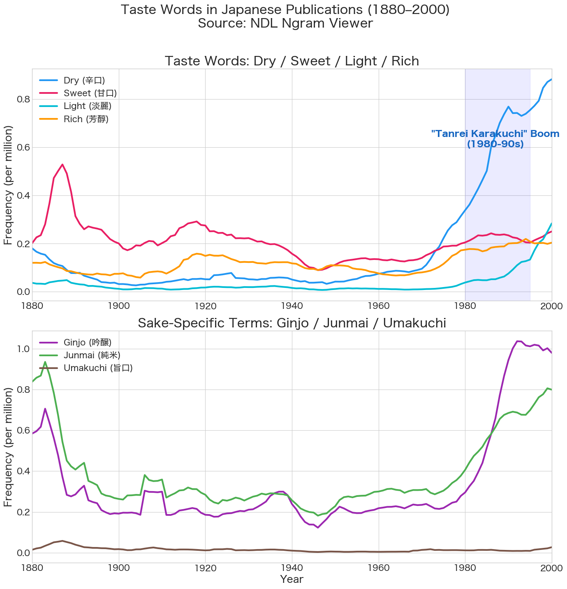
*Figure 1: Frequency of taste-related words in Japanese publications (1880–2000). Source: NDL Ngram Viewer.*

There is an important caveat here: this dataset is not limited to sake. It tracks word frequency across publications more broadly. So I'm using it not as a direct history of sake, but as a rough backdrop for how the language of taste changed over time.

In that long-run view, "sweet" (*amakuchi*) was by far the more common term in the Meiji era (1880s). That fits with what earlier scholarship has often noted: in the Edo period, sake discourse was centered more on sweetness than dryness.

Over the next century, however, "sweet" gradually declined, while "dry" rose sharply from the 1970s onward. Since *tanrei* — a term much more specific to sake — was rising at the same time, it makes sense to read this, at least at the level of discourse, as the period when the *tanrei karakuchi* boom firmly took hold.

One common explanation is that the prestige attached to "dry" emerged as a reaction against postwar *sanzoshu* — cheaply stretched sake made by adding brewing alcohol, sugars, and acidifiers to pad out rice-short brews to roughly three times the original volume, notorious for its cloying sweetness. But at least in the publication record, I could not find evidence that "dry" surged immediately after World War II.

The lower panel tells a different but related story: "ginjo" explodes from the 1980s onward, which lines up neatly with the ginjo boom. In that sense, the idea that "dry sake is good sake" looks less like a timeless standard than a relatively recent value — one that became mainstream in the 1970s and 1980s.

---

## 2. On SAKETIME, the Top-Ranked Bottles Really Do Skew Sweet

Next comes SAKETIME: 5,386 bottles and roughly 370,000 reviews. What this gives us is not a picture of the whole sake market, but a clear view of the preferences of active enthusiasts. Even with that limitation, it is a powerful way to see what kinds of bottles are being rewarded at the top.

### Structured Ratings: Higher Rank, Sweeter and Lighter

On SAKETIME, users rate each sake on two simple scales: sweet-to-dry and light-to-heavy. Once you aggregate those ratings by ranking tier, the pattern becomes hard to miss.

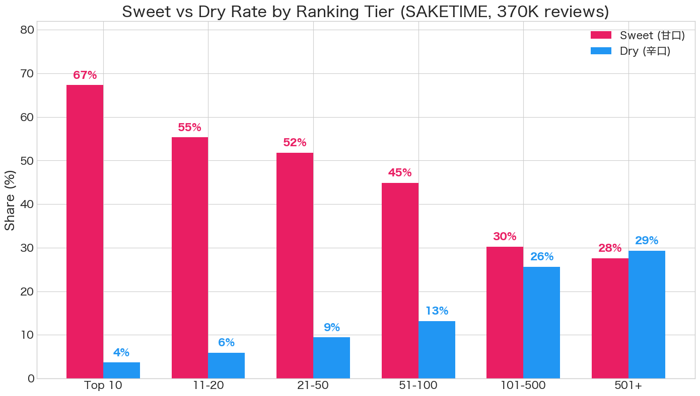
*Figure 2: Sweet rate and dry rate by ranking tier. Data: SAKETIME, 370K reviews.*

- **Sweet rate** (sweet +1 or above): 67.3% in Top 10, 30.2% in ranks 101–500, 27.6% in ranks 501+
- **Dry rate** (dry +1 or above): 3.7% in Top 10, 25.7% in ranks 101–500, 29.3% in ranks 501+
- **Heavy/rich rate** (heavy +1 or above): 11.2% in Top 10, 18.4% in ranks 101–500

The gap in sweet rate between the Top 10 (67%) and the long tail (28%) is a full 40 percentage points. The dry rate tells the mirror-image story: bottles in the 501+ range (29%) are more than seven times as likely to be described as dry as those in the Top 10 (4%).

So the YouTube video was right about one thing: the top of the ranking really does lean sweet.

But "sweet" is not the same thing as "heavy," "thick," or "umami-bomb." In fact, rich/heavy profiles are *less* common at the top. What rises to the top is not a weighty style, but something sweeter and more refined in shape: expressive, polished, and easy to keep drinking.

### Review Language Shows Just How Strong "Fruity" Has Become

Structured ratings tell only part of the story, so I also looked at the language people use in review text.

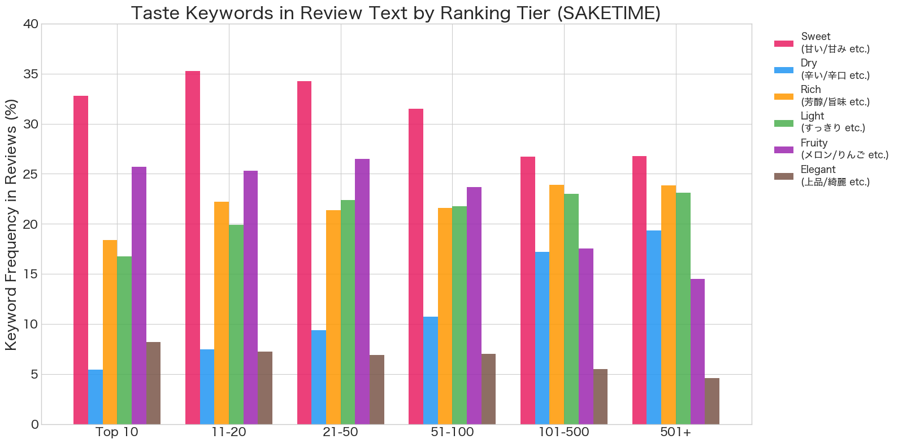
*Figure 3: Taste keyword frequency in review text by ranking tier.*

- **Sweet-type keywords**: 32.8% in Top 10, 26.8% in ranks 501+
- **Dry-type keywords**: 3.7% in Top 10, 16.8% in ranks 501+ (dramatically lower at the top)
- **Fruity-type keywords**: 24.7% in Top 10, 13.3% in ranks 501+ (roughly double at the top)
- **Rich-type keywords**: 17.9% in Top 10, 23.2% in ranks 501+ (actually lower at the top)

Another pattern becomes clear here. The higher the ranking, the less often reviewers talk about dryness — and the more often they reach for words like "fruity." Sweet-related terms are somewhat more common at the top too, but what really stands out is the combination of fruit, brightness, and refinement.

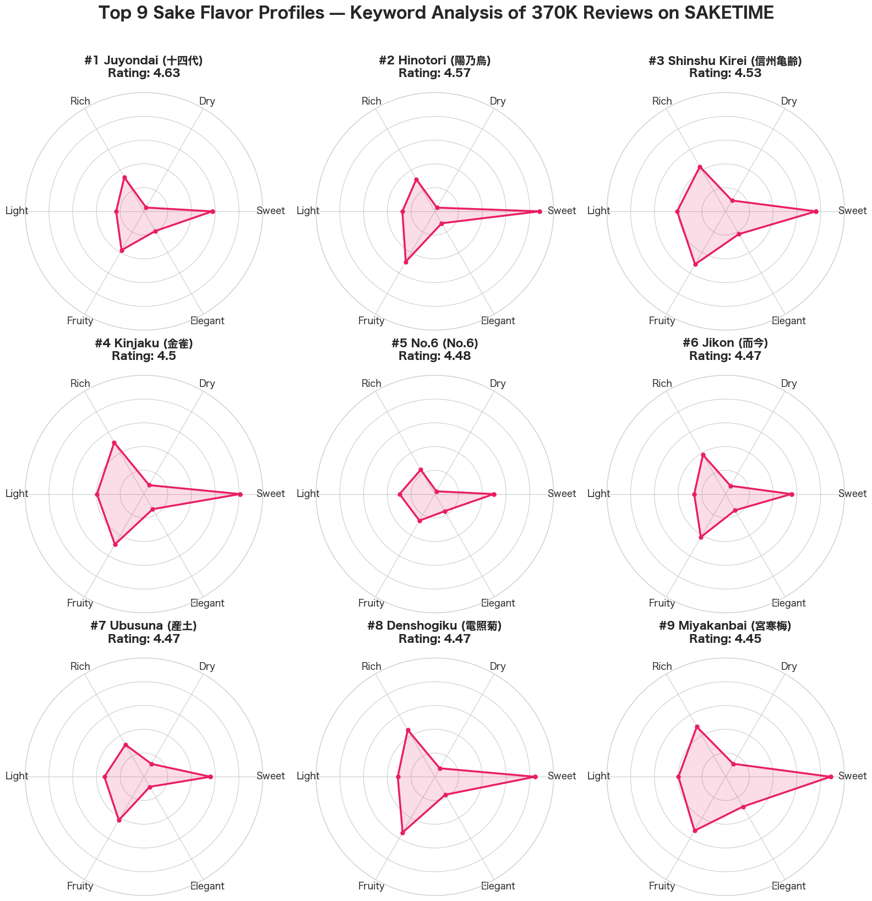
*Figure 4: Top 9 sake flavor profiles — keyword analysis of 370K reviews on SAKETIME.*

Looking at the top-ranked bottles individually makes that even clearer. Hanaabi stands out for how often reviewers describe it as fruity (37%). Hinotori and Miyakanbai stand out for sweetness (44%). Juyondai, by contrast, is strikingly balanced: it is rarely called dry (1.8%), but it is not described as especially sweet either. That suggests that the aesthetic of top-ranked sake is not simply "the sweeter, the better," but something closer to balance, elegance, and aromatic lift.

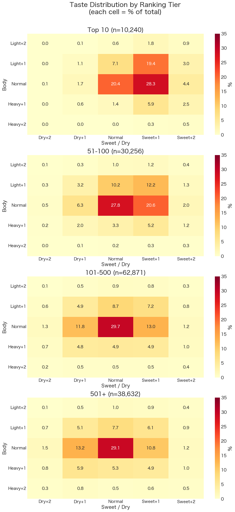
*Figure 5: Taste distribution (body × sweet/dry) by ranking tier. Each cell = % of total.*

The same point shows up in the body-by-sweetness distribution. The top-ranked bottles cluster not around heavy richness, but around medium-bodied, slightly sweet profiles. What seems to win is not heft, but sake that feels light on its feet, aromatic, and cleanly expressive of sweetness.

---

## 3. But the Story Isn't Simply "Everything Is Getting Sweeter"

So is the enthusiast community simply moving in one direction, toward sweetness? The time series from 2017 to 2025 suggests a more complicated story.

### In Structured Ratings, Sweetness Is Established — But Not Unchallenged

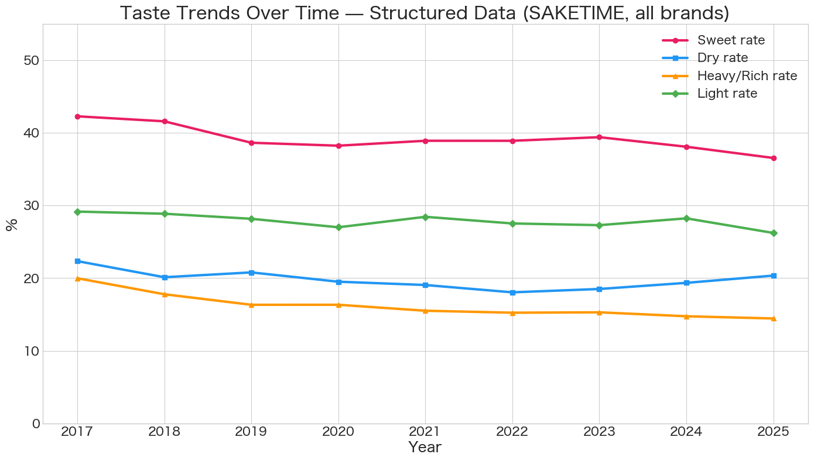
*Figure 6: Taste trends over time — structured data, all brands.*

- **Sweetness** remains the most prominent tendency, but gradually declines from 42% in 2017 to 37% in 2025
- **Dryness** falls until around 2022, then edges back up (from 18% back to the low 20s)
- **Heavy styles** keep losing ground, from 20% to 14%
- **Lighter styles** remain relatively stable at around 28–30%

The key point is that "sweet has become mainstream" does not automatically mean "dry is over." Sweetness remains the dominant style in the data, especially at the top. But dryness has not disappeared from the community as a whole. If anything, the recent data hints at a modest rebound.

### In Review Text, "Fruity" Is Growing Faster Than "Sweet"

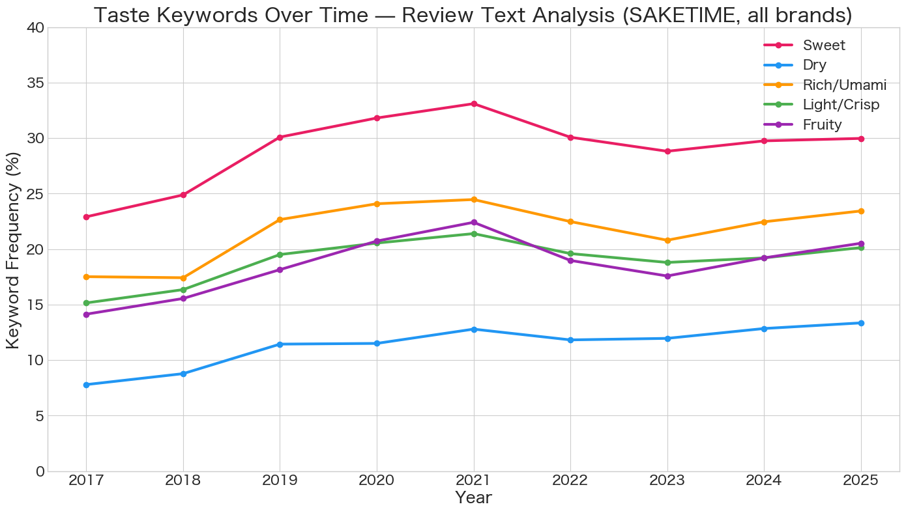
*Figure 7: Taste keyword trends over time — review text analysis, all brands.*

The review text points in the same direction. The clearest long-term increase is not in "sweet" but in "fruity" — from 17% in 2017 to 25% in 2025.

That matters because it suggests the shift is not just toward sweetness in the abstract. It is toward a particular premium style: sweet, aromatic, polished, and fruit-driven. Rather than a simple move from dry to sweet, what we may be seeing is a broader diversification of taste — with fruity language becoming the new default at the top.

---

## 4. Among General Consumers, "Dry" Is Still the Default Search Term

Finally, I turned to Google Trends. This is not a direct measure of taste preference. What it captures is the language people use when they go looking for sake.

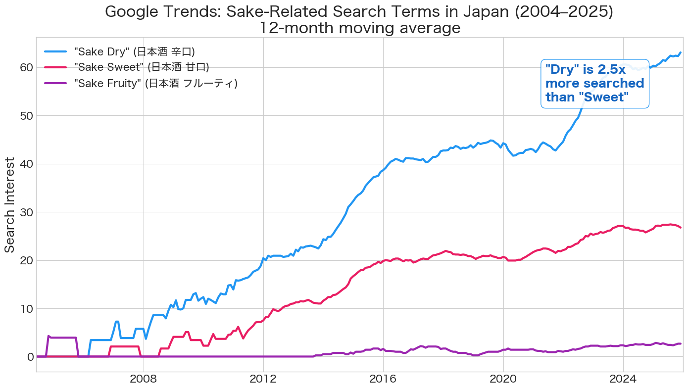
*Figure 8: Google Trends — sake-related search terms in Japan (2004–2025). 12-month moving average.*

And by that measure, "dry" is still extremely strong. Searches for "sake dry" (*nihonshu karakuchi*) consistently exceed searches for "sake sweet" by about 2.5 times — and the term has been on a long-term upward trend from 2004 to 2025.

That does not necessarily mean people prefer dry sake in the abstract. "Dry" is also an easy, familiar term at the store counter — a safe and widely understood way of narrowing down options. But whatever the reason, it is hard to argue that the word itself has become obsolete.

### Three Different Sake Worlds

Put together, these results suggest that sake today operates across three different worlds.

- **World 1: The very top of the rankings** — Sweet, fruity, and relatively light-bodied styles dominate. Sweet rate: 67%. Dry rate: 4%.
- **World 2: The long tail of the rankings** — Sweet and dry are much closer to balance. Sweet rate: 28%. Dry rate: 29%. Dry bottles are still common.
- **World 3: General consumer search behavior** — "Dry" remains the default search term, and search volume is still growing.

And as the time-series data suggests, even within the enthusiast community, dry has not disappeared. If anything, there are hints of a modest swing back.

---

## 5. So, Is the Age of Dry Sake Actually Over?

If you look only at the very top of the rankings, the answer seems to be: more or less, yes. The bottles most likely to be highly rated today tend to be sweet, fruity, and not especially heavy.

But widen the lens, and the picture changes. Dry bottles still make up a substantial part of the long tail of the rankings (29% dry rate in 501+). "Dry" remains the dominant search term in Google (2.5× that of "sweet"). And even within the enthusiast community, dry has not vanished from the conversation.

What has changed is not the existence of dry sake, but the criteria by which top-ranked bottles are celebrated — and those criteria do not perfectly match the language of the broader market.

Over a span of roughly 140 years, you can trace a broad swing in sake discourse: from sweet in the Meiji era, to dry in the late twentieth century, to today's sweet-and-fruity premium style. But that does not mean Japan has simply "returned to sweet." Sweet and fruity styles may now define the center of gravity at the top, yet dry remains alive in other parts of the sake world — and may even be edging back.

> **The era of "dry = good sake" is not exactly over. But neither is it still the best shorthand for what makes a top-ranked bottle desirable. The center of gravity has shifted toward sweet and fruity styles — without leaving dry behind.**

---

## Appendix 1: SAKETIME Overview and Caveats

Across SAKETIME as a whole, rating scores and review counts are very strongly correlated (0.888 on a log scale). That likely reflects more than quality alone: well-known bottles attract more attention, and bottles that attract attention tend to stay near the top. The top of the ranking should not be treated as a miniature version of the market as a whole.

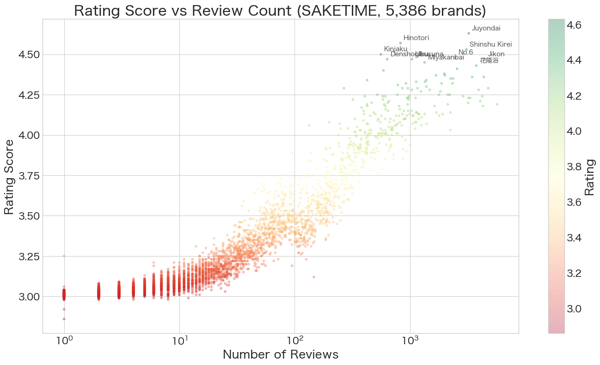
*Appendix Figure 1: Rating score vs. review count. Top 10 brands labeled.*

What this article captures is the taste profile of bottles that currently attract high ratings — not sales volume, and not the drinking behavior of the public at large.

---

## Appendix 2: Differences in Rating by Classification

Looking at formal sake classifications (*tokutei meishoshu*), junmai daiginjo (4.16) and junmai ginjo (4.05) receive the highest average ratings, while honjozo (3.79) and futsushu (3.75) score somewhat lower. That is intuitive, but the gap is only about 0.4 points — classification matters, but it does not determine everything.

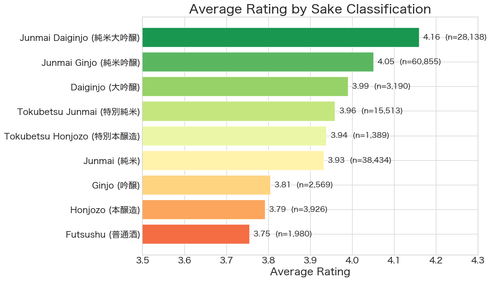
*Appendix Figure 2: Average rating by sake classification.*

---

## Appendix 3: Independent Verification With Sakenowa Data

To make sure these results were not simply artifacts of SAKETIME, I cross-checked them against flavor data from Sakenowa, a sake community app with a public API and more than one million check-ins. Its API provides flavor charts for roughly 3,100 bottles using six numerical axes — floral, rich, heavy, mellow, light, and dry — along with 141 flavor tags.

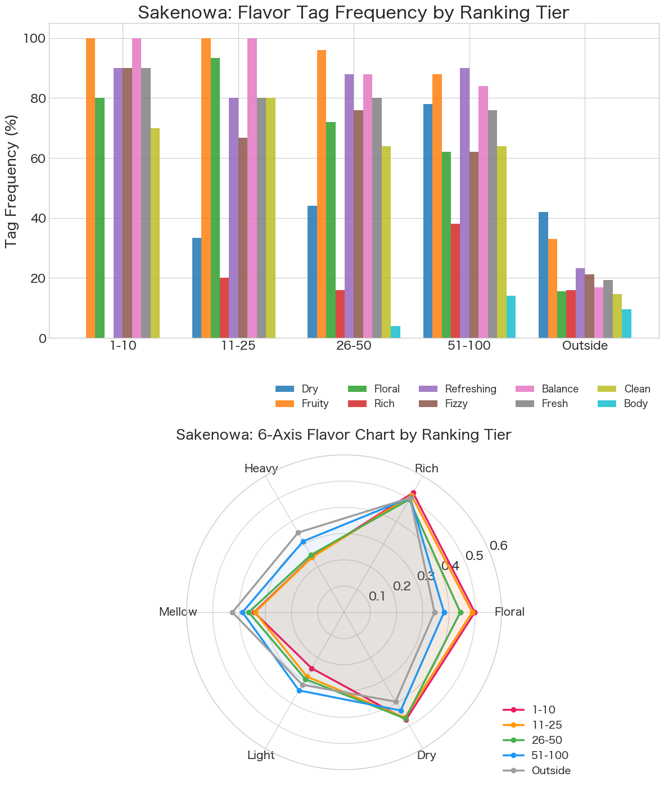
*Appendix Figure 3: Sakenowa flavor chart — six-axis average by ranking tier. Source: Sakenowa Data Project (sakenowa.com).*

The overall pattern held. Higher-ranked bottles score higher on floral character (1–10: 0.50 → outside ranking: 0.35) and lower on heaviness (1–10: 0.24 → outside: 0.35). Flavor tags tell a similar story: dry and heavy descriptors appear more often in the middle and lower tiers, while the top is defined more by elegance, lightness, and balance.

In other words, the basic finding survives a second dataset: the higher the rank, the more likely a bottle is to lean fruity — and the less likely it is to be heavy or overtly dry.

---

## Methods and Data Sources

- **SAKETIME data**: Scraped in Python (BeautifulSoup). 5,386 ranked brands, roughly 370,000 reviews.
- **Text analysis**: Keyword frequency counts and cross-tabulation by ranking tier and year.
- **Sakenowa data**: Public API from the Sakenowa Data Project. ~3,100 brands, 6-axis flavor charts, 141 flavor tags. Data processed and adapted from [sakenowa.com](https://sakenowa.com).
- **Publication data**: National Diet Library NDL Ngram Viewer API (~2.3M books and magazines).
- **Search trends**: Google Trends via pytrends, Japan, 2004–2025.

**On NDL Ngram Viewer**: Word frequencies reflect all publications, not only sake contexts. "Dry" includes uses like "dry commentary"; "sweet" may include food contexts. Terms like *tanrei*, *ginjo*, and *junmai* are more sake-specific but not perfectly exclusive. Treat as a rough historical backdrop, not a precise measure.

**On Sakenowa flavor tags**: Unlike SAKETIME's exclusive sweet/dry ratings, Sakenowa tags are accumulated from review text (avg. 9.4 tags/brand). 30% of brands carry both "sweet" and "dry" tags. Tag frequency reflects how often a characteristic is mentioned, not a strict classification.

**On reviewer bias**: SAKETIME's 370K reviews come from 4,625 users, but the distribution is heavily skewed. The top poster alone contributed ~14,000 reviews (3.8%). The top 100 users (2.2%) account for 37% of all reviews; the top 500 (10.8%) for 72%. Results may be disproportionately shaped by a small group of heavy reviewers.

---

*Data retrieved: April 14, 2026*
