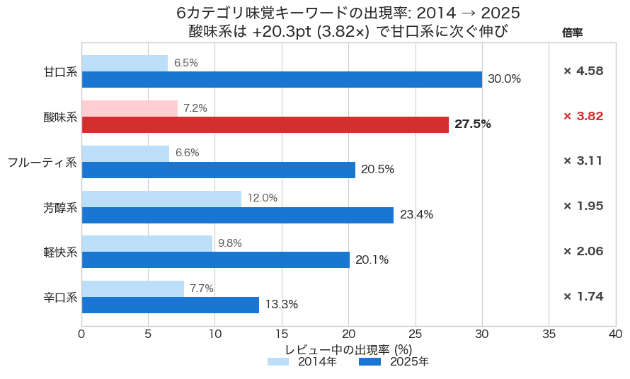
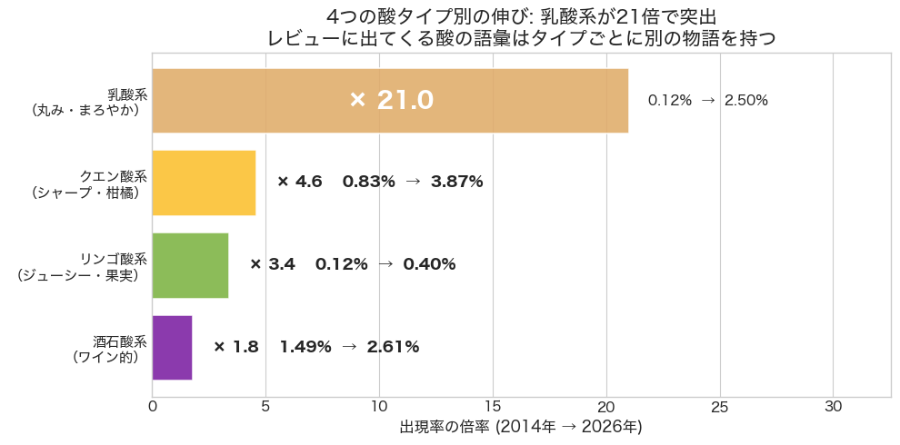
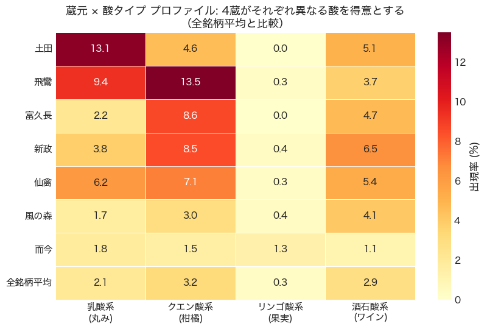
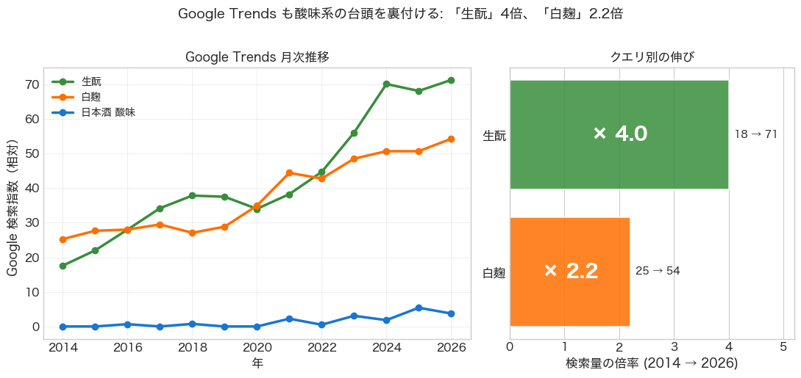

# 辛口の次に来たのは「酸味」だった —— 32万件のレビューと10年の検索データから見える、日本酒のもう一つの主役

## 前作の続きから

前作「[辛口がいい酒の時代は終わったのか？](#)」で、私はこんな結論にたどり着いた。SAKETIME 上位 10 銘柄の 67% が「甘口」とタグ付けされ、辛口は 4% しかいない。レビューテキストでは「フルーティ」が 25% で上位を語る筆頭語になっている。それでも Google で検索される量は「日本酒 辛口」が「日本酒 甘口」の 2.5 倍。**辛口は死んだのではなく、上位銘柄を評価する物差しから降りた**、というのが結論だった。

## あるコメントが残っていた

前作を Instagram にも投稿したら、コメント欄でひとつ印象的なやり取りがあった。

`@namazakepaul` という、米国ポートランドで日本酒のインポーター [Namazake Paul Imports](https://namazakepaulimports.com/) を営む Paul さんから「**The rise of acidity is interesting too**（酸味の台頭も面白いよ）」というコメントをいただいた。Paul さんの輸入会社は自社のことを *"unpasteurized, bold, high acid and sometimes cloudy craft sake"* — つまり生酒で、ボディがあり、**酸が高く**、ときに濁った craft sake を扱うと自称している。本記事のテーマそのものを扱う輸入業者からのコメントだったわけだ。

私の返信はこんな趣旨だった。「**同意です。ただ酸味（acidity）は辛口（karakuchi）のような確立された日本酒の語彙ではないので、長期トレンドが追いにくい。SAKETIME の構造化評価も甘辛・濃淡の2軸しかなく、酸味専用の指標がないから構造的な分析にも限界がある。ただ、レビューのテキストを実際に解析すれば何か出てくるかもしれない。やってみて、見えたらまた共有しますね**」。

それに対する Paul さんの返事が、しばらく頭に残り続けた。

> *That's interesting as Karakuchi isn't a regulated term but Total Acidity is an objective data point.*
> （興味深いね。辛口は規定された用語ではないが、酸度は客観的なデータポイントとして存在する）

確かに、日本酒には「酸度」という公式の指標がある。中和滴定で測られる、ラベルにも書かれる数字だ。もちろん甘辛の側にも「日本酒度」という客観指標はあって、比重を介して糖分の残量を反映している。「辛口は完全に主観、酸度だけが客観」と言うつもりはない。ただし Paul さんが指摘していたのは、**「辛口」という呼称そのものが規定された用語ではない**という点で、これは正確だ。日本酒度 +5 のひと瓶を、ある蔵は「辛口」と書き、別の蔵は「中口」「やや辛口」と書く — どこからが「辛口」かに法的・業界的な合意はない。一方、酸度は数値そのものが直接ラベルに乗る。**「辛口」が呼称（数値からの主観的翻訳）であるのに対し、「酸度」は計測値そのもの — ラベル上の定義の明確さでは、むしろ酸度の側が一段上を行く**。それなのに、レビューの言葉のなかで「酸味」は「辛口」「甘口」より圧倒的にマイナーな存在に見える。直接ラベルに書かれる数値のほうが、なぜ語られないのか。あるいは、語られ始めているとしたら、いつから、どんな速さで、どんな種類の酸が増えているのか。

書き終えてからずっと引っかかっていた **「辛口が物差しから降りたなら、何が代わりに上がってきたのか」** という問いと、Paul さんの「呼称ではなく数値の側に酸はある」という指摘が、頭の中で繋がった。

「甘口」と「フルーティ」というのは前作の結論の延長としては答えになる。だが、上位銘柄を実際に飲んだことがある人なら気づくと思うが、新政も仙禽も陽乃鳥も、ただ甘くてフルーティなだけではない。共通して舌の上で立ち上がる、もう一つの感覚がある。それは「酸味」だ。

新政・仙禽あたりが牽引した、明確な酸味のある日本酒。日本酒の世界では長らく「酸が立つ」のは欠陥に近い扱いだった。火落ち菌の代謝物として、酢酸が増えてしまった失敗酒の特徴。それが、いつの間にか個性として評価されるようになっている。

このストーリーが、本当にデータに表れているかを確かめたかった。前作と同じ 32万件のレビューに、いくつか新しいデータと手法を足して、もう一度掘り直してみた。結論から書くと、**「酸味」は辛口の地位を引き継ぐような形でこの10年に静かに台頭してきた、現代日本酒のもう一つの主役**だった。Paul さんへの「やってみて、見えたら共有します」という宣言を、ようやくここで果たすことになる。

---

## 1. 「酸味」という6番目のカテゴリ

前作の時系列分析では、5つの味覚カテゴリ（甘口系・辛口系・芳醇系・軽快系・フルーティ系）の出現率を10年単位で追いかけていた。今回はそこに6つ目「酸味系」を加えてみた。

「酸味系」と一言で言ってもどう定義するかが問題になる。最終的に、化学的に酸味と直接結びつく16語（酸味・酸度・乳酸・甘酸っぱい・甘酸・柑橘・レモン・ライム・グレープフルーツ・柚子・シトラス・ヨーグルト・ワイン・葡萄・梅干し・プラム・ベリー・キウイ・白麹）に絞った。各語が単独で出現しただけで「酸味の話」と認められる、誤爆の少ないコアな語彙のみ採用している（選定の方法論は末尾の補足にまとめた）。

結果はかなり明瞭だった。

*図1: 全銘柄レビューにおける6カテゴリ味覚キーワードの出現率。酸味系は +20.3pt (3.82×) で甘口系に次ぐ伸び。*

絶対値の伸びでは甘口系が +23.4pt で1位、酸味系が +20.3pt で2位。倍率では甘口系が 4.58倍、酸味系が 3.82倍で続く。**フルーティ系より大きく、辛口系の倍以上のペースで、酸味系が伸びている**。これは前作の集計には含めていなかった軸で、私自身も書き始めるまで規模感を見誤っていた。

ちなみに辛口系の伸びは6カテゴリ中で最も鈍い 1.74倍にとどまる。前作の結論「辛口は死んではいない」は今回の集計でも維持されるが、**他カテゴリと並べると明らかに置き去りにされつつある**ことが見える。

## 2. 「酸」と一言で語れない4つの顔

酸味語の単純な出現率を眺めるだけでは、トレンドの中身が見えない。日本酒に含まれる主要な有機酸は4種類ある（[さけストリート](https://sakestreet.com/ja/media/what-is-acidity) や [SAKETIMES](https://jp.sake-times.com/think/study/sake_g_sour-taste-of-sake) の記事に詳しい）。乳酸・クエン酸・リンゴ酸・酒石酸。それぞれ生まれる過程も、舌の上での感じ方も別物だ。

- **乳酸**: 丸く、まろやか。ヨーグルト的。山廃・生酛造りで自然に生まれる
- **クエン酸**: シャープで爽快、柑橘的。白麹・黒麹を使う蔵が増えている
- **リンゴ酸**: 爽やかでジューシー、果実的。特定の酵母（28号など）由来
- **酒石酸**: ワイン的な酸。葡萄由来の表現と結びつく

私の作った16語の酸味系語彙を、この4タイプに振り分けて、それぞれを年次で追いかけてみた。

*図2: 4つの酸タイプ別の出現率の伸び (2014年 → 2026年)。乳酸系は 0.12% → 2.50% で21倍。*

**最も劇的なのは乳酸系の 21倍**。出現率の絶対値はまだ大きくないが、これは生酛・山廃の再評価とぴったり呼応する。前作で「辛口は終わってない」と書いたとき、辛口復権の予兆として 2022年以降辛口率がやや戻る傾向を見たが、同じ時期に乳酸系も上がっている。「軽快な辛口」ではなく、「複雑で旨い辛口」が戻ってきているのかもしれない。

クエン酸系の絶対値は最大で、2026年に 3.87%。これは白麹を採用した銘柄（富久長・黒兜など）の台頭と連動している。後で詳しく見るが、Google Trends の「白麹」検索量とほぼ完全に同期している。

酒石酸系（葡萄・ワイン）は 2014年時点で既に 1.49% と最も高く、伸びは 1.8倍と最小。ワインライクな表現は 10年前から定着していて、新しいトレンドというより既存の評価軸だったことが分かる。

## 3. 機械学習も自発的に「酸味トピック」を見つけた

ここまでは「私が決めた酸味系語彙の出現率」という、いわば仮説主導の分析だ。仮説の入力なしに、機械が酸味を一つのトピックとして抽出できるかどうかも、別途試した。

トピックモデルという手法がある。文書集合の中から潜在的なテーマを統計的に抽出する手法で、何もラベルを与えずに「これらの文書は何について書かれているか」を機械が当てる、というイメージに近い。今回は LDA というモデルと、年を共変量として持たせた DMR（構造的トピックモデルに相当）を使い、トピック数 K=20 で 247,485 件の前処理済みレビューを学習させた。

結果、**LDA では 20 トピック中 8 つ、DMR でも 9 つに、酸味関連の語（酸味・酸・酸度・キレ・シャープ・爽やか・さっぱり・ジューシー・乳酸 のうちいずれか）が上位 20 語に含まれた**。たとえば LDA の Topic 2 は「炭酸・ワイン・ガス・発泡・爽やか・スパークリング・甘酸っぱい・乳酸・シュワ」のように、明確に「酸味のあるスパークリング系」を意味する独立トピックを形成していた。

つまり、誰も「酸味について書こう」と指示しなくても、レビュー全体を眺めた機械学習モデルは、酸味を一つの主要なテーマとして自発的に切り出してくる。**酸味が独立した評価軸として機能していることが、定義の外側からも確認できた**ということだ。

## 4. 酸の地図を描いた4つの銘柄

新政、仙禽、土田、富久長。それぞれの銘柄が、4つの酸タイプのうちどれを得意とするかを、レビュー内の酸味系語彙の出現率で可視化してみた。

今回の銘柄選定は **4つの酸タイプそれぞれに代表となる銘柄を1〜2つ立て、対照として酸味と別の路線で高評価を得ている銘柄を並べる** という意図で行っている。具体的には、乳酸系の代表として山廃・生酛で知られる **土田**、クエン酸系の代表として白麹採用の **富久長・飛鸞**、酸味のある日本酒文化を牽引したオリジネーターとして **新政・仙禽**。これに、クリーン・微発泡系の代表 **風の森** と、繊細・上品な酒質設計の **而今** を対照群として加えた7銘柄を、全銘柄平均と並置している（レビュー数100件未満の銘柄は除外）。データから上位を機械的に拾った選定ではない点は明記しておきたい。

なお、本稿ではあえて銘柄名で統一している。「富久長」を造るのは今田酒造、「風の森」を造るのは油長酒造、というように、銘柄と蔵元の名前は一致しないことのほうがむしろ普通だ。レビューを書く側が認識しているのは銘柄であり、本稿の集計単位もレビュー数ベースの銘柄なので、表記もそれに揃えている。

*図3: 酸味先行銘柄ごとの酸タイプ別出現率（全期間平均、%）。各銘柄が異なる酸の方向に特化していることが見える。*

特筆すべきは **土田の乳酸系 13.1%（全国平均 2.1%の 6倍）** と、**富久長のクエン酸系 8.6%（全国平均の 2.7倍）**。どちらも作り手の公式な方針（土田酒造は山廃・生酛、今田酒造は「海風土」など白麹採用）と、レビュー言語の現れ方が一致している。

新政が興味深いのは、生酛回帰で有名な銘柄でありながら、データ上はクエン酸系 (8.5%) と酒石酸系 (6.5%) のほうが乳酸系 (3.8%) より高く出る点だ。これは新政の幅広い商品ライン（No.6・PRIVATE LAB シリーズ・陽乃鳥など）の多様性を反映しているはずで、「生酛回帰の銘柄 = 乳酸系一辺倒」では捉えきれない実態が見える。

仙禽がほぼ全方位で平均を上回っているのは、酸味系日本酒のパイオニアとして全タイプの表現を試みてきた銘柄の幅広さを示しているように思う。一方、而今が全タイプで全国平均を下回るのは、「繊細・上品」を貫く酒質設計の現れだろう。前作のラダーチャートで而今が辛口・甘口どちらにも振り切らないバランス型として出てきたのとも整合する。

## 5. 検索行動も同じ方向を指している

ここまでは SAKETIME のレビュー言語のなかでの話だ。一般消費者の検索行動も同じ方向を向いているかを確かめるために、Google Trends を取り直した。**「日本酒 酸味」「白麹」「生酛」** の 3 クエリを 2014–2026 で見ると、生酛は検索量が4倍、白麹は2.2倍に増えている。

*図4: Google Trends で見た「日本酒 酸味」「白麹」「生酛」の年次推移（左）とクエリ別の倍率（右）。「日本酒 酸味」自体は検索量が極めて小さいことも見えている。*

ここから二つのことが読み取れる。

一つは、**消費者は「酸味」という抽象語ではなく、「白麹」「生酛」など具体的な製法名で検索している**こと。レビューを書く愛好家は「酸味」と書くが、検索する一般消費者は「製法」のレベルで探す。これは日本酒の議論層と購買層の間にあるリテラシー差を示す、興味深い構造だと思う。

もう一つは、Google Trends とレビュー言語の **相関の強さ**。年次データで Pearson 相関を計算すると、**白麹 × クエン酸系レビュー出現率の相関は r = 0.877**、生酛 × 乳酸系レビュー出現率は r = 0.707 と、いずれも非常に高い。化学（白麹がクエン酸を多量生成する）、製法（白麹採用蔵の増加）、検索行動（白麹検索の上昇）、レビュー言語（クエン酸系語彙の増加）が、ぴったり同じ方向で動いている。

つまり前作で言うところの「3つの世界」（上位ランキング・下位ランキング・一般消費者検索）は、酸味というテーマに関しては **同じ向きを指している**。辛口の話では3層が食い違っていたが、酸味では揃っているのだ。

## 6. 「3つの世界」を、もう一度書き直す

前作の最後の章で、私はこんな表を書いた。

- **世界1（ランキング上位）**: 甘口率 67%・辛口率 4% — 甘口・フルーティ・軽め
- **世界2（ランキング下位）**: 甘口率 28%・辛口率 29% — 拮抗、辛口生存
- **世界3（一般消費者検索）**: 「日本酒 辛口」が「日本酒 甘口」の 2.5倍

今回の分析を経て、これと並列で書ける「酸味の3層」がある。

- **世界1（ランキング上位 Top10）**: CORE 出現率 20.8%、CORE ∪ RELATED は 30% を超える。上位銘柄は明確に酸味を語られる
- **世界2（ランキング下位）**: 全体平均と大きな差はない。酸味系の伸びは全層で起きている
- **世界3（一般消費者検索）**: 「酸味」自体は検索されないが、「白麹」「生酛」が 2〜4 倍に上昇。製法レベルで関心が伝わっている

辛口は「上位では棄てられたが、下位と検索には生き残っている」軸だった。**酸味はその逆で、全層を貫いて立ち上がっている**。これは10年前にはなかった現象だ。

## 結論: 重心は単に動いただけではない

前作の結論はこうだった。「重心は辛口から甘口・フルーティへ移動した。ただし辛口を完全に置き去りにしてはいない」。続編としてここで書き加えたいのは、**移動した先の重心の正体は、もう少し複雑だった**、ということだ。

「甘口」と「フルーティ」だけでは、現代の上位銘柄の特徴を語り切れない。新政の生酛、仙禽のリンゴ酸、土田の山廃、富久長の白麹。同じ「酸味のある日本酒」と語られる4銘柄は、それぞれ違う化学反応で違う酸を作っていて、レビュー言語の中でもそれぞれ違う pattern を残している。データを4つに分けて眺めて初めて、新政と仙禽の違い、土田と富久長の違いがはっきり見える。

そして消費者は「酸味」とは検索しない。でも「白麹」「生酛」と検索する量は、確実に増えている。**抽象的な味覚語ではなく、具体的な製法を通じて、酸味への関心が一般層にも浸透し始めている**。

> 辛口の時代は「淡麗辛口」という一次元の物差しの時代だった。それに代わる新しい時代は、4つの異なる化学が、4つの異なる物語を語り、消費者がそれを製法の名前で覚えていく時代だ。日本酒の言葉は、その複雑さにまだ追いつき始めたところにある。

辛口の次に来たのは「酸味」だった、というのが私の見ている景色だ。ただし「酸味」と一言で片付けると、半分も伝わらない。乳酸の丸み、クエン酸のシャープさ、リンゴ酸のジューシーさ、酒石酸のワイン的な複雑さ。次に飲む一本があるなら、その4つのどれにあたるかを意識してみると、きっと違って見える。

---

## データと手法について

**主要データ**
- SAKETIME レビュー: 367,330 件、4,737 銘柄、2014〜2026 年。前処理済みで分析対象としたのは 322,644 件（コメント付き、日付パース可能なもの）
- 日本語形態素解析: `fugashi` + `unidic-lite`。動詞は精度が低いため除外、名詞・形容詞・形状詞のみ採用。1文字トークン・銘柄名・汎用ストップワードを除外
- 「白麹」は形態素解析で「白 + 麹」に分割されるため、ユーザー辞書相当の後処理で個別補完
- Google Trends: pytrends のレート制限のため、一部は手動 DL を組み合わせた

**ACIDITY_CORE と ACIDITY_RELATED の選定**
- CORE（4語）: 酸味・酸っぱい・酸度・乳酸。単独で必ず酸味を意味する語のみ
- RELATED（16語）: 化学的根拠に基づくキュレーション。柑橘・レモン・ライム・グレープフルーツ・柚子・シトラス（クエン酸）／ヨーグルト（乳酸）／葡萄・ワイン（酒石酸）／梅干し・プラム・ベリー・キウイ（リンゴ酸系果実）／甘酸っぱい・甘酸（直接表現）／白麹（製法）

**選定の前段**として、PMI（Pointwise Mutual Information）でコーパス全体から CORE と統計的に共起する語を機械的に抽出する分析も行った（上位語は 甘味・甘み・苦味・渋み・余韻・アタック・フィニッシュ・程良い・穏やかなど）。ただしこれらは「酸味の言葉」ではなく「酸味とよく一緒に語られる語」が大半で、トレンド計測には不適と判断したため、最終的な RELATED には化学的に酸味を喚起する語のみを残している。

**トピックモデル**
- LDA: `tomotopy.LDAModel`、K=20、min_cf=50、rm_top=20、iter=500
- DMR (Dirichlet-Multinomial Regression LDA): 年を共変量として与え、年別のトピック分布変化を直接モデル化。R の `stm` パッケージの Python 等価物として利用

**コードと再現性**: 分析ノートブックとビルドスクリプトは GitHub の非公開リポジトリに保管している。本記事の図はすべて `analysis/acidity_topic_analysis.ipynb` から生成された。

**さけのわデータ・SAKETIME へのアトリビューション**: 本分析は [SAKETIME](https://www.saketime.jp/) のデータ利用許可をいただいた上で実施した（前作と同様）。[さけのわデータプロジェクト](https://sakenowa.com) のフレーバーチャートを補助的に参照している。

---

*データ取得時点: 2026年4月。集計はすべて 2014〜2026 年のレビューに対して行った。*
